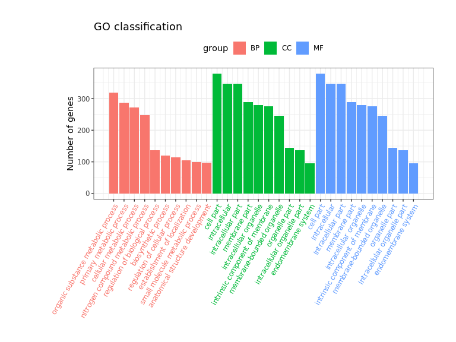
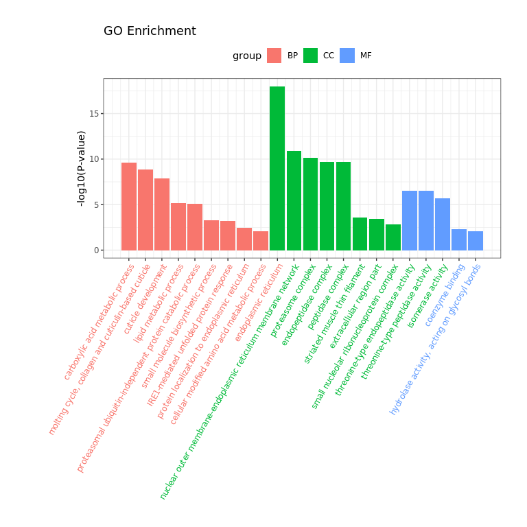
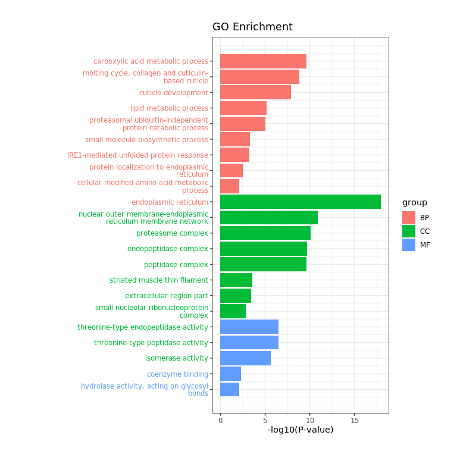
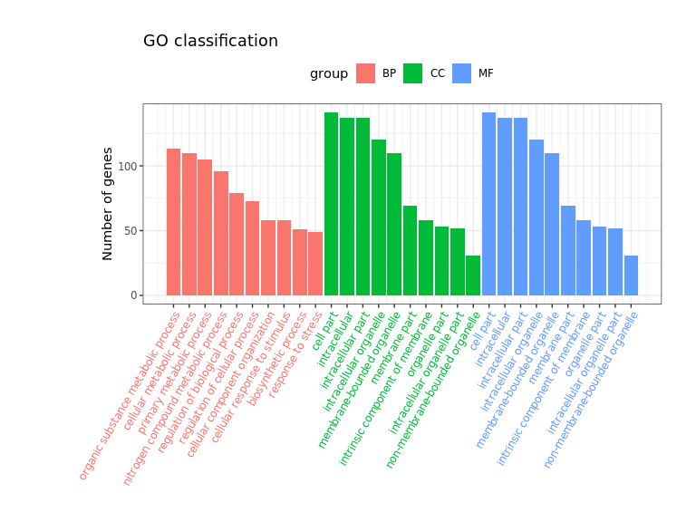

## 1. summary

See GO enrichment analysis in Section `3.1` and `3.2`.


## 2. Materials and Methods

**Genes**: Two lists of genes, up-regulated (n=345), down-regulated (n=898).

**Organism**: C. elegans 

**Annotation**: Using a Bioconductor package, `org.Ce.eg.db` (version: `3.8.2`)

**Tools**: [clusterProfiler](https://www.ncbi.nlm.nih.gov/pmc/articles/PMC3339379/) (R package, `v3.12.0`)


### GO analysis


GO enrichment analysis was performed with the R package clusterProfiler, with a Bonferroni correction and an adjusted p value of 0.01 and qvalue of 0.05 (Yu et al., 2012).

**Reference**

1. Yu G, Wang L-G, Han Y, He Q-Y. clusterProfiler: an R package for comparing biological themes among gene clusters. OMICS. 2012;16:284–7. https://doi.org/10.1089/omi.2011.0118.


## 3. Results


```
## 'select()' returned 1:many mapping between keys and columns
```

```
## Warning in bitr(df_up$`Wormbase Identifier`, "WORMBASE", "ENTREZID",
## org.Ce.eg.db, : 2.9% of input gene IDs are fail to map...
```

```
## 'select()' returned 1:many mapping between keys and columns
```

```
## Warning in bitr(df_down$`Wormbase Identifier`, "WORMBASE", "ENTREZID",
## org.Ce.eg.db, : 1% of input gene IDs are fail to map...
```


### 3.1 Down-regulated genes (n=898) 

+ GO classification

Gene classification based on GO distribution at `level=3`. 


```
## Loading required package: DOSE
```

```
## DOSE v3.10.2  For help: https://guangchuangyu.github.io/DOSE
## 
## If you use DOSE in published research, please cite:
## Guangchuang Yu, Li-Gen Wang, Guang-Rong Yan, Qing-Yu He. DOSE: an R/Bioconductor package for Disease Ontology Semantic and Enrichment analysis. Bioinformatics 2015, 31(4):608-609
```

<!-- -->

+ GO enrichment analysis

<!-- -->

Create the barplot like Figure 5D of Merkwirth et al., 2016 Cell.

<!-- -->

Saving above plots to to file: `results/go_enrich.down.pdf`


```
## png 
##   2
```

Save the original enrichment results to file: `results/go_enrich.down.xlsx`


### 3.2 Up-regulated genes (n=345) 

+ GO classification

<!-- -->

+ GO enrichment analysis

<!-- -->

Create the barplot like Figure 5D of Merkwirth et al., 2016 Cell.

<!-- -->

Saving above plots to to file: `results/go_enrich.up.pdf`


```
## png 
##   2
```


Save the original enrichment results to file: `results/go_enrich.up.xlsx`


